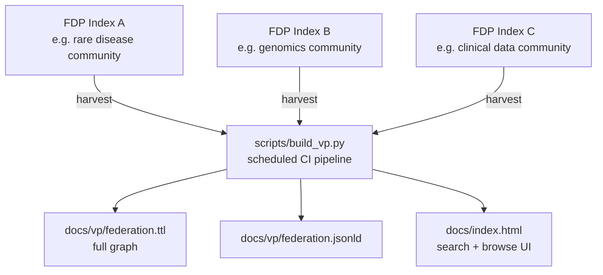

# staticfdp-vp

A **Static Virtual Platform** — the third layer of the StaticFDP ecosystem
([GitHub](https://github.com/StaticFDP/staticfdp) · [Codeberg](https://codeberg.org/StaticFDP/staticfdp)).

A Virtual Platform (VP) is a federated discovery hub that aggregates multiple
FDP Indexes into a single browsable and machine-readable catalog. Data stays
at its source; the VP only stores pointers. A CI pipeline rebuilds the
aggregated federation graph on a schedule.
No dedicated server required.

---

## Part of the StaticFDP Ecosystem

| Repository | GitHub | Codeberg | Layer |
|---|---|---|---|
| staticfdp | [github.com/StaticFDP/staticfdp](https://github.com/StaticFDP/staticfdp) | [codeberg.org/StaticFDP/staticfdp](https://codeberg.org/StaticFDP/staticfdp) | FAIR Data Point |
| staticfdp-index | [github.com/StaticFDP/staticfdp-index](https://github.com/StaticFDP/staticfdp-index) | [codeberg.org/StaticFDP/staticfdp-index](https://codeberg.org/StaticFDP/staticfdp-index) | FDP Index |
| **staticfdp-vp** ← you are here | [github.com/StaticFDP/staticfdp-vp](https://github.com/StaticFDP/staticfdp-vp) | [codeberg.org/StaticFDP/staticfdp-vp](https://codeberg.org/StaticFDP/staticfdp-vp) | Virtual Platform |

---

## How it works

1. **Register** — an FDP Index operator opens a GitHub Issue or submits a PR
   adding a YAML file to `registered-indexes/`
2. **Aggregate** — a scheduled CI pipeline (`scripts/build_vp.py`) fetches
   `index.ttl` from every registered FDP Index, merges the catalogs, and
   resolves each FDP's own `catalog.ttl`
3. **Publish** — the pipeline writes `docs/vp/federation.ttl` (the full
   federation graph) and `docs/index.html` (HTML search + browse), then
   commits; GitHub / Codeberg Pages serves the result immediately



---

## Quick start

**GitHub:**
```bash
git clone https://github.com/StaticFDP/staticfdp-vp
cd staticfdp-vp
bash scripts/setup.sh          # configure GitHub / Codeberg / both
```

**Codeberg:**
```bash
git clone https://codeberg.org/StaticFDP/staticfdp-vp
cd staticfdp-vp
bash scripts/setup.sh
```

Then:
1. Set secrets (`GITHUB_TOKEN` for GitHub Actions, `FORGEJO_TOKEN` for Woodpecker)
2. Enable GitHub Pages (branch `main`, path `/docs`)
3. Register FDP Indexes by opening *Register FDP Index* Issues

---

## Registering an FDP Index

Open an Issue using the **Register FDP Index** template and provide:
- Index name
- Index catalog URL (must resolve to valid Turtle or JSON-LD)
- Contact / maintainer

The aggregation pipeline runs daily and on every new registration.

---

## Configuration (`vp-config.yaml`)

```yaml
virtual_platform:
  title: "My Virtual Platform"
  base_url: https://OWNER.github.io/staticfdp-vp
  publisher_name: "My Organisation"
  publisher_url: https://example.org/

infrastructure:
  primary: github          # github | codeberg | both
  github:
    enabled: true
    repo: OWNER/staticfdp-vp
    pages_url: https://OWNER.github.io/staticfdp-vp
  codeberg:
    enabled: false
    repo: OWNER/staticfdp-vp
    base_url: https://codeberg.org
    pages_url: https://OWNER.codeberg.page/staticfdp-vp

aggregate:
  schedule: "40 4 * * *"
  timeout_seconds: 30
  soft_fail: true
```

---

## Relation to the ELIXIR / GA4GH Virtual Platform

The FAIR Data Point Virtual Platform concept originates from the
[ELIXIR](https://elixir-europe.org/) and
[GA4GH](https://www.ga4gh.org/) communities. The reference implementation
uses a Java/Spring Boot server with Blazegraph. `staticfdp-vp` is a
fully static alternative — same DCAT-AP semantics, no server required.

---

## Secrets required

| Secret | Purpose |
|---|---|
| `GITHUB_TOKEN` | Commit generated files (GitHub Actions) |
| `FORGEJO_TOKEN` | Commit generated files (Woodpecker / Codeberg) |

---

## Authors

This work was envisioned and built by:

| Name | ORCID |
|---|---|
| Rajaram Kaliyaperumal | [](https://orcid.org/0000-0002-1215-167X) |
| Eric G. Prud'hommeaux | [](https://orcid.org/0000-0003-1775-9921) |
| Egon Willighagen | [](https://orcid.org/0000-0001-7542-0286) |
| Andra Waagmeester | [](https://orcid.org/0000-0001-9773-4008) |

Machine-readable citation metadata is available in [`CITATION.cff`](CITATION.cff) and [`codemeta.json`](codemeta.json).

---

## License

MIT.
